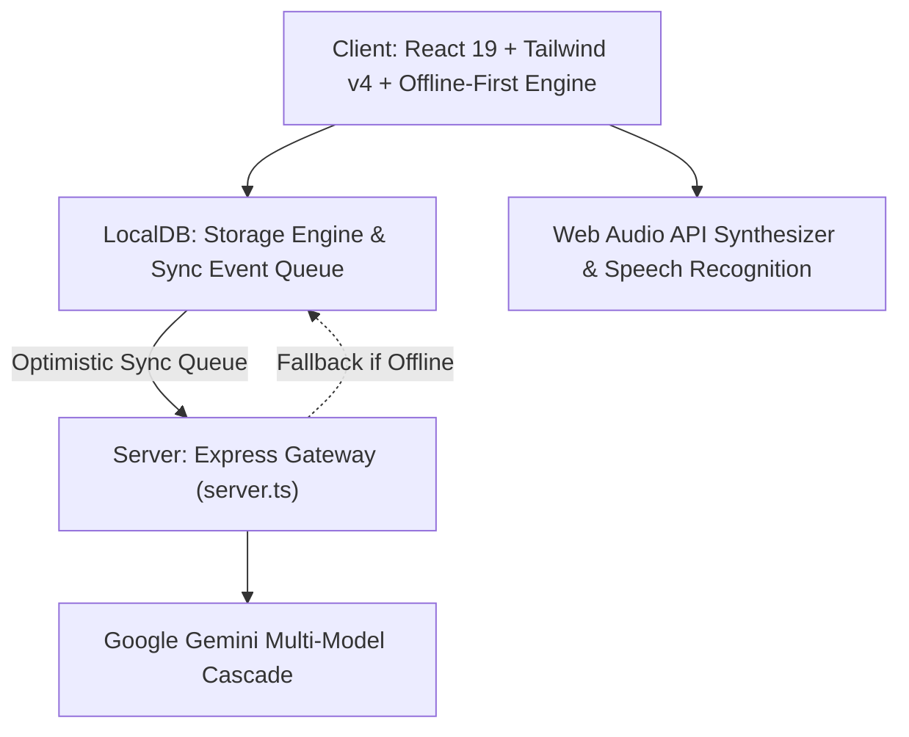

# MIND MITHRA — Master Implementation Plan
> **Platform Name:** MIND MITHRA (Cultural Cognitive Care & Reminiscence Platform)  
> **Official Product Name:** MIND MITHRA (Strict Branding Requirement)  
> **Role:** Lead Architect & Full-Stack / AI / Offline-First / Accessibility Engineering Team  
> **Scope:** Complete Architectural Synthesis, Feature Integration, and Phased Roadmap  

---

## 1. Current Architecture

Mind Mithra is structured as a modern, reactive, offline-first hybrid platform:
- **Client Layer:** React 19.0.1 with Tailwind CSS v4, Motion 12, Lucide React 0.546, and Recharts 3.10.
- **Server Layer:** Node.js with Express 4.21 and Vite 6.2 in middleware mode, exposing REST API endpoints and fallback handling.
- **Data & State Layer:** In-memory + browser persistent storage engine (`localDB`) wrapping `localStorage` and `IndexedDB` with an optimistic FIFO synchronization event queue (`/api/sync/events`).
- **Audio & Voice Processing:** Web Audio API procedural synthesis (`soundscapeEngine.ts`), Web SpeechRecognition API with turn-taking state machine, and SpeechSynthesis / Gemini TTS audio decoding.
- **Vision & Expression:** HTML5 canvas camera frame grabber with local luminance/contrast heuristics + Gemini Vision API cascade (`gemini-2.5-flash`, `gemini-2.5-flash-lite`, `gemini-2.0-flash`).
- **Cognitive Engine:** 30 categorized workouts across working memory, attention, pattern sequencing, language, spatial categorization, motor coordination, relaxation, and executive routines with Dynamic Difficulty Adjustment (DDA).

---

## 2. Current Working Features

These features are existing, verified, and will be preserved without regression:
1. **30 Cognitive Games Catalog & DDA Engine:** Validated neuroplasticity stimulation games covering 10 domains with adaptive difficulty (Levels 1 to 5) and fatigue tracking.
2. **Camera Mood & Expression Analyzer:** Local canvas landmark heuristics + Gemini Vision classification with soothing spoken feedback.
3. **Kinship Family Tree with Audio Voice Notes:** Visual generational circle mapping + 1-tap playback of loved ones' comforting recorded voices to counteract prosopagnosia.
4. **Caregiver Telemetry Dashboard:** Longitudinal Recharts graphs tracking 7-day cognitive accuracy, medication adherence, response speed, and alert handling.
5. **Medical Report & Prescription NER:** Document/image upload extracting medications, dosages, cognitive stage, and automatically configuring daily reminders.
6. **Emergency SOS & Loud Alert Siren:** 1-Tap SOS alert modal with 5-second countdown, Web Audio distress siren, and caregiver dispatch.
7. **Safe Haven Reassurance Modal:** 4-7-8 breathing pacer and home location grounding to alleviate sundowning agitation.
8. **Reminders & Medication Cueing:** 24-hour structured cueing schedule with time-of-day slots, custom countdown timers, and audible alerts.
9. **Procedural Soundscapes:** Real-time synthesized bamboo flute, Shillong pine forest, and Brahmaputra river ripples.
10. **Memory RAG Retrieval:** Conversational question-answering over verified memories with zero hallucination constraints.
11. **Demo Walkthrough Bar:** 12-step guided demonstration mode switching roles and network states.
12. **DOCX Clinical Telemetry Generator:** Standalone script generating formatted Word clinical assessment summaries.

---

## 3. Broken / Inconsistent Features

The following items require immediate correction:
1. **Branding Inconsistencies:** Residual occurrences of "MANAS" in `server.ts` health endpoint (`app: 'MANAS-NER Cognitive Platform'`), `server.ts` logging, `Brand/ManasLogo.tsx`, and storage keys (`manas_*`). All must be unified strictly to **MIND MITHRA**.
2. **Speech Recognition Silence Timeout:** Current timeout is 1.4s, which terminates abruptly for elderly speakers experiencing hesitation, dysarthria, or word-finding delay. Must be extended to 2.4s.
3. **Locale Selection Consistency:** Language selector in header occasionally desynchronizes from active patient profile upon profile reset.
4. **Offline Voice Commands:** Missing direct intent routes for "Play my daughter's voice", "Show my family", "Call my son", and "Help me".

---

## 4. Missing Features (The 21 Ideas from Reference)

The following concepts from the reference specification must be implemented:
1. **Feature 1 — Memory Web:** Interactive connected personal memory graph (People ↔ Places ↔ Events ↔ Photos ↔ Music ↔ Stories ↔ Memories).
2. **Feature 2 — Language Bridge:** Full dictionaries and voice mappings for Tamil (`ta`), Garo (`grt`), and Kokborok (`trp`).
3. **Feature 3 — Elder Knowledge:** "Teach Mind Mithra" capture module for traditional recipes, farming, crafts, folklore, and local practices.
4. **Feature 4 — Familiar Route Memory:** Spatial sequence recall (Home → Temple → Market → Daughter's House) with landmarks and consent controls.
5. **Feature 5 — Life-Skill Simulator:** Interactive procedural simulation (making traditional Assam tea, sorting ingredients, gardening routines).
6. **Feature 6 — Personal Soundscape ("My Sounds"):** Custom family voice clips, rain, market, and traditional ambient soundboard with favorites.
7. **Feature 7 — Tell Me About Your Day:** Daily voice journal conversation, transcript review, editing, and journal history.
8. **Feature 8 — Story Builder:** Multimodal story creator transforming photos, voice, people, and places into structured storybooks.
9. **Feature 9 — Reminiscence Theater:** Interactive memory scenes with photo sequences, voice narration, and "What happened next?" choices.
10. **Feature 10 — Memory-to-Game Generator:** Backend `/api/ai/game-generator` dynamically generating quizzes and sequencing puzzles from verified memories.
11. **Feature 11 — Dynamic Theme Adapter:** Theme tokens adapting to family memories, music, and nature preferences.
12. **Feature 12 — Memory Confidence Map:** Personalized domain confidence map across family, places, music, tasks, routines, people, and events.
13. **Feature 13 — Gentle Evening Mode:** System-wide dusk mode with warm muted palette (#FFFDF7, sage/peach/gold), reduced motion, and calming cues.
14. **Feature 14 — Family Contribution Mode:** Role-based contribution workflow with caregiver verification toggle and notifications.
15. **Feature 15 — Memory Capsules:** Scheduled surprise memory gift packages (morning surprise, festival memory, birthday).
16. **Feature 16 — Memory Chain:** Guided 5-question wizard (WHO? WHERE? WHEN? WHAT HAPPENED? HOW DID YOU FEEL?) linking memories.
17. **Feature 17 — Today's Why:** Plain-language reasoning badge explaining why each activity was chosen for patient and caregiver.
18. **Feature 18 — Voice-to-Action:** Expanded offline intent mapping for emergency help, family voice playback, calling family, and reminders.
19. **Feature 19 — Emotional Preference Memory:** Dynamic tracking of user reactions updating preferred topics and avoiding disliked stimuli.
20. **Feature 20 — Family Memory Collaboration:** Multi-member collaboration with attribution badges and permission controls.
21. **Feature 21 — Teach My Family:** Generational cultural memory archive where elders preserve recipes, wisdom, and oral history.

---

## 5. Duplicate Features

- **Audio Playback Handlers:** Audio playback logic exists in `FamilyTreeView`, `ReminiscenceRadioView`, and `audioService.ts`. All voice note playback will be centralized through `audioService.ts` to ensure consistent volume, error handling, and speech interruption.
- **Logo Components:** `Brand/ManasLogo.tsx` renders "MIND MITHRA" text but is named `ManasLogo`. It will be refactored to `Brand/MindMithraLogo.tsx` with a backwards-compatible alias.

---

## 6. Architecture Gaps

- **Memory Graph Model:** Lack of an explicit relational graph index connecting `MemoryItem`, `FamilyMember`, and cultural knowledge items.
- **Service Worker Caching:** PWA `manifest.json` exists, but an explicit Service Worker script caching core HTML/CSS/JS shell for 100% offline cold boot is missing.

---

## 7. Database Gaps

- **Entities Needed in Storage:**
  - `MemoryGraphNode` and `MemoryGraphEdge` (relational graph structure).
  - `CulturalKnowledgeItem` ("Teach Mind Mithra" and "Teach My Family" items).
  - `RouteMemory` (familiar routes, landmarks, consent flag).
  - `DailyJournalEntry` (daily voice journal entries).
  - `MemoryCapsule` (scheduled surprise packages).
  - `MemoryChain` (thematic linked question chains).
  - `UserPreferenceProfile` (learned likes, dislikes, favorite people/music).

---

## 8. API Gaps

- **New Backend Gateway Endpoints in `server.ts`:**
  - `POST /api/ai/game-generator`: Generates validated cognitive activities from verified user memories.
  - `POST /api/ai/story-builder`: Stitches memory assets into coherent structured stories without hallucinating facts.
  - `POST /api/ai/clinical-report`: Generates structured clinical progress summaries for authorized doctors.
  - `GET /api/knowledge`: Returns regional cultural knowledge archive entries.

---

## 9. AI Gaps

- **Zero-Hallucination Guardrails:** Enforce strict verification rules in system prompts ensuring the AI only references user-verified data.
- **Multimodal Content Tagging:** Automatic cultural and relational entity tagging for uploaded family photos.

---

## 10. Voice Gaps

- **Elderly Cadence Support:** Increase speech silence debounce to 2.4 seconds to accommodate prolonged hesitation and word-finding pauses.
- **Multilingual TTS Mapping:** Ensure native Indian voice synthesis accents for English, Hindi, Bengali, Tamil, Assamese, and regional dialects.

---

## 11. Offline Gaps

- **Full Offline Shell:** Register a dedicated Service Worker caching app shell assets so the application boots instantly without internet connectivity.
- **Local Fallbacks for All New Features:** Memory Web, Route Memory, Life-Skill Simulator, Daily Journal, and Soundscapes must operate 100% locally in offline mode.

---

## 12. Security Gaps

- **Privacy Invariants:** Video and microphone streams must remain strictly on-device in canvas/Web Audio buffers; no raw continuous streaming to cloud servers.
- **Explicit Geolocation Consent:** Familiar Route Memory and SOS location sharing must require explicit, visible user consent.

---

## 13. Accessibility Gaps

- **Touch Target Sizing:** All interactive elements must maintain a minimum bounding box of 48px × 48px for arthritic or tremor-affected hands.
- **Motion Reduction:** Honor `prefers-reduced-motion` and implement an automatic motion-reduction toggle in Gentle Evening Mode.

---

## 14. UI/UX Gaps

- **Color Palette Alignment:** Implement the official Mind Mithra elderly palette:
  - Background: `#FFFDF7`
  - Deep Sage: `#58745A`
  - Medium Sage: `#789477`
  - Memory Peach: `#C66F4E`
  - Muted Gold: `#B28A32`
  - Text: `#26302A`
  - Card: `#F8EBD8`
  - Soft Sage: `#E2EBD9`

---

## 15. Testing Gaps

- **Automated Verification:** Create end-to-end regression scripts verifying DDA adjustments, offline event queueing, speech intent parsing, and memory graph traversal.

---

## 16. Deployment Gaps

- **Production Bundling:** Verify `dist/server.cjs` and Vite static assets build with zero TypeScript warnings.
- **Environment Documentation:** Maintain `.env.example` with clear instructions for `GEMINI_API_KEY` and deployment port configuration.

---

## 17. Implementation Order (Phased Execution)

1. **Phase 1 — Core Architecture & Branding Alignment:**
   - Standardize all branding to **MIND MITHRA** across server, storage keys, components, and headers.
   - Inject the official elderly color tokens into CSS and theme configurations.

2. **Phase 2 — Multilingual Bridge & Elderly Voice Accommodation:**
   - Add Tamil (`ta`), Garo (`grt`), and Kokborok (`trp`) to translations and voice mappings.
   - Adjust speech recognition debounce to 2.4s for elderly speech pacing.
   - Expand offline voice-to-action intents.

3. **Phase 3 — Database Expansion (`localDB` & Schemas):**
   - Implement schemas and storage methods for Memory Web graph, Route Memory, Daily Journal, Memory Capsules, Memory Chains, Elder Knowledge, and Preferences.

4. **Phase 4 — AI Gateway Endpoints (`server.ts`):**
   - Implement `/api/ai/game-generator`, `/api/ai/story-builder`, and `/api/ai/clinical-report` with Gemini cascade and deterministic local fallbacks.

5. **Phase 5 — Cognitive & Memory Enhancements:**
   - **Feature 1:** Memory Web interactive visual graph component.
   - **Feature 4:** Familiar Route Memory & spatial sequence recall.
   - **Feature 5:** Life-Skill Simulator (Assam tea making, gardening, cooking).
   - **Feature 6:** Personal Soundscape ("My Sounds") soundboard and playlists.
   - **Feature 7:** Tell Me About Your Day (Daily Voice Journal).
   - **Feature 8:** Story Builder interactive wizard.
   - **Feature 9:** Reminiscence Theater with interactive "What happened next?".
   - **Feature 10:** Memory-to-Game Generator frontend view.

6. **Phase 6 — Personalization, Evening Mode & Family Collaboration:**
   - **Feature 11 & 12:** Dynamic Theme Adapter & Memory Confidence Map.
   - **Feature 13:** Gentle Evening Mode with warm palette and motion reduction.
   - **Feature 14 & 20:** Family Contribution & Multi-Member Collaboration mode.
   - **Feature 15 & 16:** Memory Capsules & Memory Chain.
   - **Feature 17:** Today's Why reasoning modal and chips.
   - **Feature 19:** Emotional Preference Learning engine.
   - **Feature 3 & 21:** Elder Knowledge ("Teach Mind Mithra") & "Teach My Family" archive.

7. **Phase 7 — PWA Service Worker & Offline Infrastructure:**
   - Implement and register Service Worker for static asset offline caching.
   - Verify offline cold boot and sync queue resumption.

8. **Phase 8 — Testing, Quality Assurance & Verification:**
   - Build automated verification test suite for DDA, offline storage, intent parser, and API endpoints.
   - Verify TypeScript compilation (`tsc --noEmit`) and production build (`vite build`).

9. **Phase 9 — Documentation & Walkthrough:**
   - Create and update comprehensive documentation suite: `README.md`, `ARCHITECTURE.md`, `AI_ARCHITECTURE.md`, `VOICE_ARCHITECTURE.md`, `OFFLINE_ARCHITECTURE.md`, `DATABASE.md`, `API.md`, `SECURITY.md`, `TESTING.md`, `DEPLOYMENT.md`.
