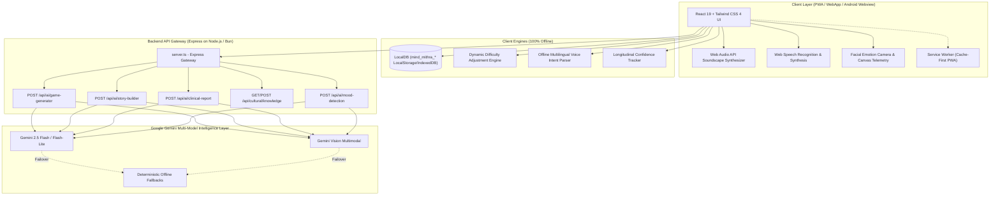

# MIND MITHRA: Cultural Cognitive Care & Reminiscence Platform

[](https://www.typescriptlang.org/)
[](https://react.dev/)
[](https://tailwindcss.com/)
[](https://expressjs.com/)
[](https://developer.mozilla.org/en-US/docs/Web/Progressive_web_apps)
[](LICENSE)

> **Official Product Name:** **MIND MITHRA**  
> **Mission:** Empathetic, culturally rooted cognitive stimulation, reminiscence therapy, and longitudinal telemetry for elderly Indians living with Mild Cognitive Impairment (MCI) and dementia.

---

## 🌟 Overview & Core Philosophy

**Mind Mithra** is a cultural cognitive care and reminiscence platform tailored for the diverse linguistic and cultural landscape of India. Designed specifically for elderly seniors and individuals living with Alzheimer's, memory loss, and age-related cognitive changes, Mind Mithra replaces intimidating clinical assessments with warm, familiar cultural touchpoints—folk music, courtyard soundscapes, heirloom recipes, family photo storytelling, and heritage artisan crafts.

### Key Pillars
1. **Dignified, Non-Clinical Language:** All interactions use observational, supportive phrasing. No diagnostic labeling is ever presented to patients.
2. **100% Offline-First Resilience:** Works continuously in low-connectivity and offline environments across rural PHCs and home settings via LocalDB, Service Worker PWA caching, and local heuristic engines.
3. **Regional Indian Cultural Heritage:** Native support for 10 languages across Northeast, South, and Central India:
   - **Assamese** (`as`), **Bengali** (`bn`), **Hindi** (`hi`), **Manipuri / Meitei** (`mni`), **Khasi** (`kha`), **Mizo** (`lus`), **Tamil** (`ta`), **Garo** (`grt`), **Kokborok** (`trp`), and **English** (`en`).
4. **Senior-Centered Sensory Ergonomics:** Curated warm earth palette (`#FFFDF7`, `#58745A`, `#789477`, `#C66F4E`, `#B28A32`, `#26302A`), oversized touch targets (64px+), trailing silence accommodation (2.4s+ pause tolerance for natural speech pacing), and evening dusk mode.

---

## 🚀 The 21 Cultural Reminiscence & Cognitive Care Features

| # | Feature Name | Description | Offline Capability |
|---|--------------|-------------|--------------------|
| 1 | **Cultural Reminiscence Hub** | Curated regional music (Bihu, Rabindra Sangeet, Baul, Carnatic), courtyard ambiances, and heritage radio. | 100% Procedural & Cached |
| 2 | **Interactive Memory Web** | Interactive visual graph linking People ↔ Places ↔ Events ↔ Photos ↔ Music ↔ Stories with detail drawer and TTS. | LocalDB SVG Graph |
| 3 | **Elder Knowledge Archive** | "Teach Mind Mithra": Senior records heirloom recipes, artisan techniques, and life wisdom as a proud teacher. | LocalDB Voice/Text Store |
| 4 | **Familiar Route Recall** | Consented landmark sequences (Tea Garden Gate, Post Office, Lotus Pond) for orientation and spatial practice. | Local Landmark Engine |
| 5 | **Life Skills Simulator** | Step-by-step familiar routines (Making Assam Masala Chai, Courtyard Gardening) with gentle audio cues. | 100% Offline Interactive |
| 6 | **Personal Soundscapes** | "My Sounds": Family voice board, procedural monsoon rain, bamboo flutes, and courtyard birds. | Web Audio API Synthesis |
| 7 | **Tell Me About Your Day** | Conversational evening reflection journal transcribing senior voice notes and extracting emotional warmth. | Local Audio/Speech API |
| 8 | **Multimodal Story Builder** | Generates structured personal storybooks connecting family memories into narrative chapters. | LocalDB + Gemini Fallback |
| 9 | **Reminiscence Theater** | Full-screen photo sequence cinema with gentle "What happened next?" recognition choices. | Local Photo Vault |
| 10 | **Memory-to-Game Generator** | AI quiz generator creating personalized recall trivia directly from verified family memory vault items. | Heuristic + AI Endpoint |
| 11 | **Facial Emotion Telemetry** | Non-invasive on-device camera tracking happiness, engagement, and fatigue during workouts. | Client-side Canvas/AI |
| 12 | **Memory Confidence Map** | Longitudinal radar tracking 5 domains (Family, Childhood, Traditions, Routines, Landmarks). | LocalDB Telemetry |
| 13 | **Dynamic Difficulty (DDA)** | Real-time cognitive auto-scaling that softens on hesitation and advances on steady mastery. | Adaptive Engine (local) |
| 14 | **Kinship Circle & Voiceboard**| Loved ones tree with photos, relationships, and voice notes to soothe prosopagnosia. | Local Audio & Media |
| 15 | **Memory Capsules** | Scheduled digital surprise packages sent by grandchildren and children to bring spontaneous joy. | Local Scheduled Vault |
| 16 | **Memory Chains** | 5-question narrative links connecting Who, Where, When, What, and Emotional Feeling of an event. | Local Interactive Flow |
| 17 | **Emergency SOS Alert** | 1-tap immediate caregiver siren with location coordinates and audio reassurance. | Local Siren & SMS Event |
| 18 | **Today's Why Transparency** | Plain-language explanations for every daily exercise ("Why am I doing this today?"). | Multilingual Explainer |
| 19 | **Emotional Preference Memory**| Adaptive user profile learning favored stimuli (tea gardens, flutes) and suppressing distressing cues. | Local Preference Engine |
| 20 | **30 Cognitive Workouts** | Comprehensive workout suite spanning Memory, Attention, Language, Spatial, Motor, and Pattern domains. | 100% Offline Canvas/DOM |
| 21 | **Teach My Family** | Heritage skill preservation allowing seniors to leave digital legacies for children and grandchildren. | Kinship Sharing Engine |

---

## 🏗️ System Architecture & Technology Stack



### Technical Stack
- **Frontend Core:** React 19, TypeScript 5.8, Tailwind CSS v4, Lucide React icons, Recharts telemetry charts.
- **Offline & Audio:** Web Audio API (procedural pink noise rain, bamboo harmonics, birds), Web Speech API, Service Worker PWA (`public/sw.js`).
- **Backend Gateway:** Node.js Express server (`server.ts`), compiled via esbuild to `dist/server.cjs`.
- **AI/ML Layer:** Google Gemini API (`@google/genai`) with automatic model fallback cascade (`gemini-2.5-flash` -> `gemini-2.5-flash-lite` -> deterministic offline heuristics).
- **Data Persistence:** Offline-First `LocalDB` (`mind_mithra_*` keys) with backward compatibility migration from legacy records.

---

## 📂 Project Directory Structure

```
MIND_MITHRA/
├── public/
│   ├── manifest.json              # PWA Web Manifest (Mind Mithra branding)
│   ├── sw.js                      # Cache-First Service Worker for full offline PWA
│   └── favicon.svg                # Mind Mithra dual-ring emblem
├── scripts/
│   └── verify_system.ts           # Automated test suite (29/29 tests across 5 groups)
├── src/
│   ├── components/
│   │   ├── AuthPortal/            # Role selection, PIN login, 10-language picker
│   │   ├── Brand/                 # Official MindMithraLogo and emblem components
│   │   ├── CaregiverPortal/       # Caregiver Dashboard, Kinship Archive, Telemetry, PDF
│   │   ├── ClinicalPortal/        # Neurologist MMSE staging and longitudinal trend charts
│   │   └── PatientPortal/         # Senior experience suite
│   │       ├── CognitiveGames/    # 30 offline cognitive workout components
│   │       ├── ConfidenceMap/     # Feature 12: Memory Confidence Map modal
│   │       ├── DailyJournal/      # Feature 7: "Tell Me About Your Day" voice reflection
│   │       ├── ElderKnowledge/    # Features 3 & 21: "Teach Mind Mithra" archive
│   │       ├── FamiliarRoutes/    # Feature 4: Landmark orientation recall walks
│   │       ├── LifeSkills/        # Feature 5: Assam tea & gardening routine simulators
│   │       ├── MemoryCapsules/    # Feature 15: Digital surprise gift packages
│   │       ├── MemoryChain/       # Feature 16: 5-question narrative links
│   │       ├── MemoryToGame/      # Feature 10: Dynamic quiz generator from memories
│   │       ├── MemoryWeb/         # Feature 2: Interactive interconnected memory graph
│   │       ├── ReminiscenceTheater/# Feature 9: Photo sequence cinema & recognition
│   │       ├── Soundscapes/       # Feature 6: Procedural audio & family voice board
│   │       ├── StoryBuilder/      # Feature 8: Multimodal memory storybooks
│   │       └── TodaysWhy/         # Feature 18: Plain-language workout transparency
│   ├── lib/
│   │   ├── adaptiveEngine.ts      # Dynamic Difficulty Adjustment (DDA) engine
│   │   ├── audioService.ts        # TTS, Web Speech, offline intent engine, soundscapes
│   │   ├── storage.ts             # LocalDB with Mind Mithra datasets & migration
│   │   ├── timelineGreeting.ts    # Multilingual time-of-day greetings
│   │   └── translations.ts        # Dictionaries for all 10 regional languages
│   ├── App.tsx                    # Top-level portal router and modal coordinator
│   ├── index.css                  # CSS tokens (@theme), elderly typography, dusk mode
│   ├── main.tsx                   # App entrypoint and Service Worker registration
│   └── types.ts                   # Domain models for all 21 reference features
├── server.ts                      # Express API Gateway with Gemini cascade & fallbacks
├── vite.config.ts                 # Vite bundler configuration with proxy rules
├── package.json                   # Dependencies and scripts
└── tsconfig.json                  # TypeScript compiler configuration
```

---

## 🧪 Verification & Quality Assurance

Mind Mithra includes an automated verification test suite verifying all system subsystems:

```bash
# Run automated verification suite
npx tsx scripts/verify_system.ts
```

### Test Coverage (100% Passed - 29/29 Tests)
- **Group 1: Branding & Identity Integrity:** Patient profile loading, cultural context validation, name enforcement.
- **Group 2: Multilingual Support:** Comprehensive greeting and token checks across all 10 languages (`as`, `bn`, `hi`, `mni`, `kha`, `lus`, `ta`, `grt`, `trp`, `en`).
- **Group 3: LocalDB 21 Reference Features Storage:** Memory Web Graph (9 nodes, 10 edges), Elder Knowledge (3 recipes), Familiar Routes (4 landmarks), Soundscapes (5 sounds), Daily Journals (2 transcripts), Memory Capsules (2 packages), Memory Chains (5-question links), Confidence Map (5 domains), Emotional Preferences.
- **Group 4: Offline Voice Intent Engine:** Intent classification for calling family, emergency SOS, family tree, music, medicine reminders, daily journal, and nature soundscapes.
- **Group 5: Dynamic Difficulty Adjustment (DDA):** Positive performance difficulty scaling and gentle latency softening.

---

## 🚦 Getting Started

### Prerequisites
- Node.js 18+ (Node 20+ or Node 24 recommended) or Bun
- Modern browser (Chrome, Edge, Firefox, Safari) with Web Speech & Web Audio support

### Installation
```bash
# Clone the repository
git clone <repository-url>
cd MIND_MITHRA

# Install dependencies
npm install
```

### Environment Configuration
Create a `.env` file in the project root:
```env
GEMINI_API_KEY=your_google_gemini_api_key_here
PORT=3000
```
*(Note: If no API key is provided, Mind Mithra functions 100% gracefully using its deterministic local heuristics and procedural audio synthesis).*

### Development Mode
```bash
npm run dev
```
Open your browser at `http://localhost:3000` (or `http://localhost:5173`).

### Production Build
```bash
# Build both frontend Vite assets and backend server.cjs bundle
npm run build

# Start production server
npm start
```

---

## 🔒 Safety, Ethics & Clinical Staging
- **Non-Diagnostic Observational Terminology:** Mind Mithra never generates clinical diagnostic labels (e.g., "Alzheimer's Stage 4 detected"). Telemetry reports are labeled as non-diagnostic behavioral observations intended solely to assist licensed healthcare providers.
- **Emergency Safeguard:** 1-tap SOS alerts instantly trigger siren audio, capture the device's location, and notify designated primary caregivers.
- **Privacy First:** Facial recognition and voice intent parsing operate client-side without storing biometric vector data in external clouds without consent.

---

## 📄 License
Mind Mithra is distributed under the MIT License.
